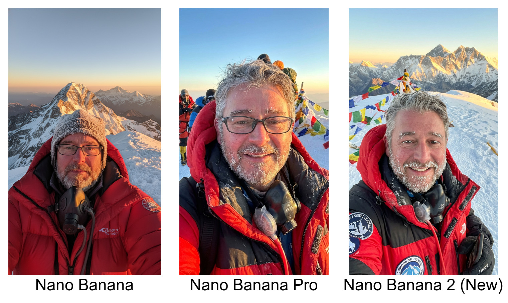
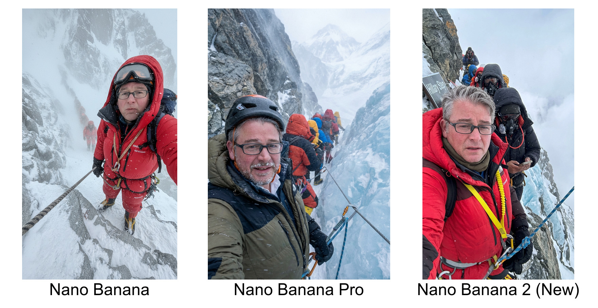
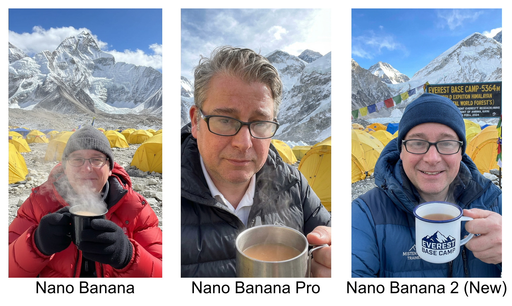
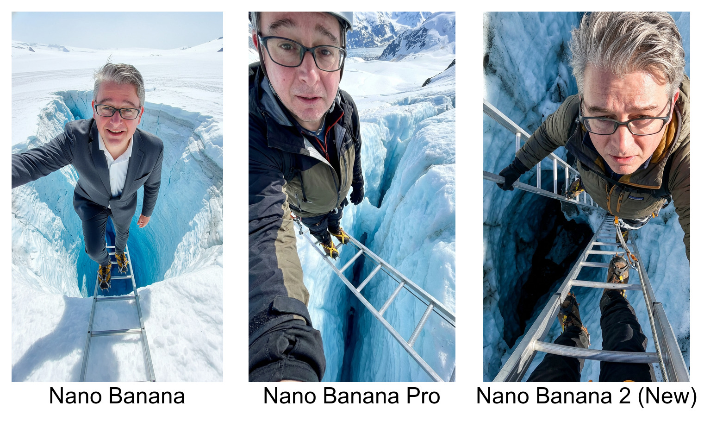
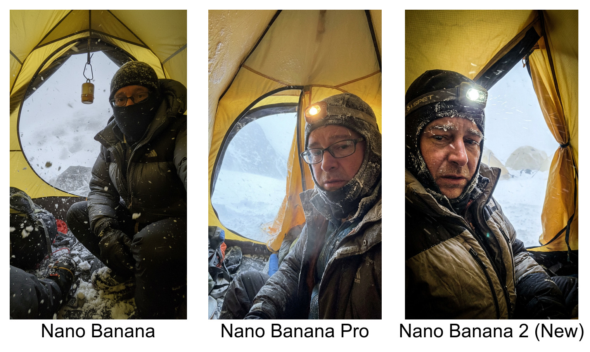
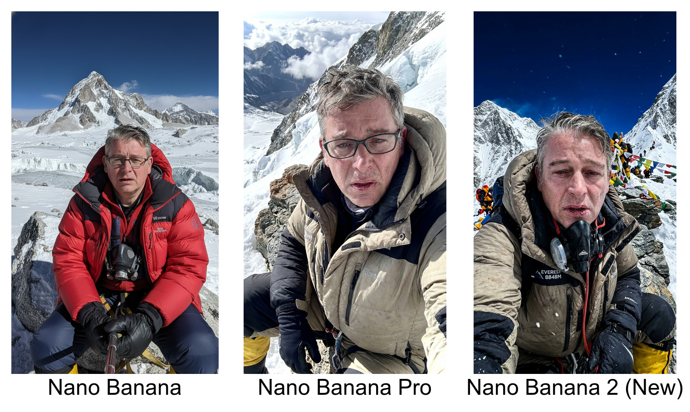
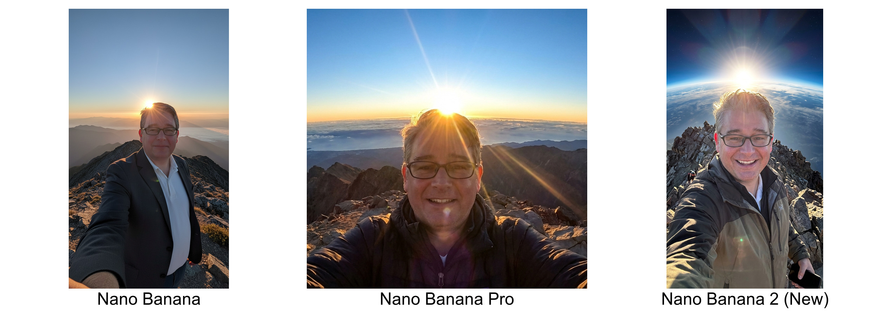
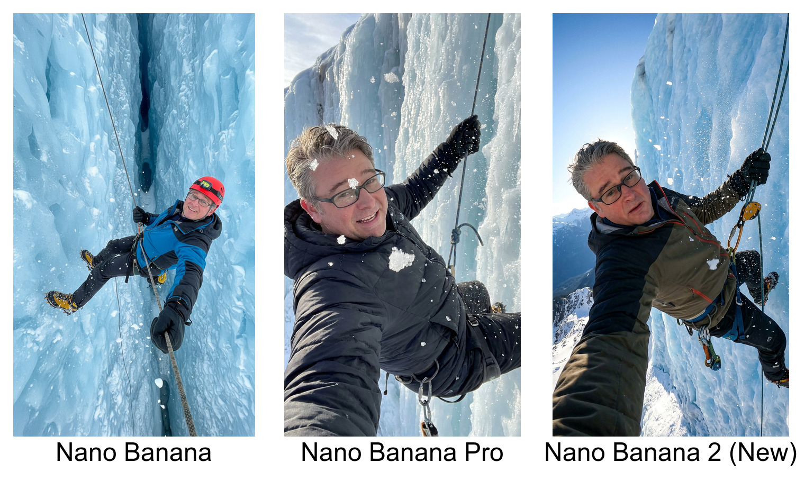
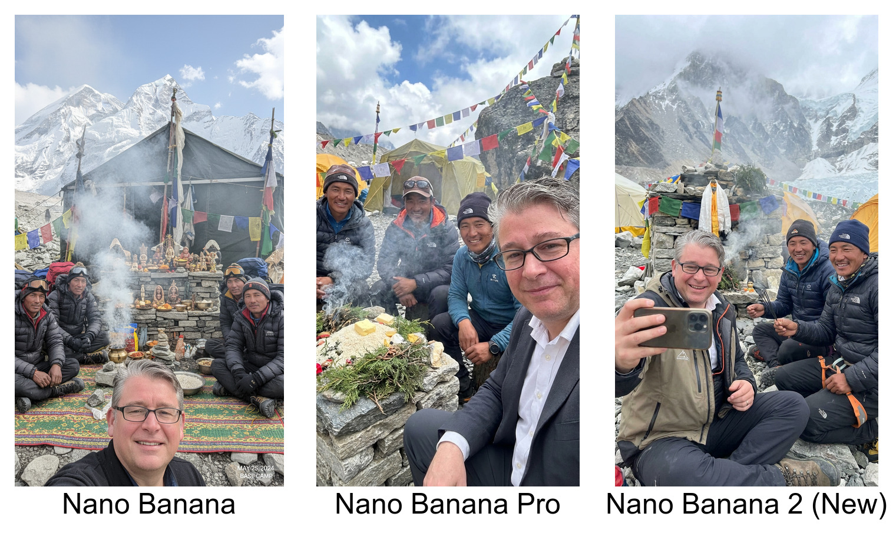
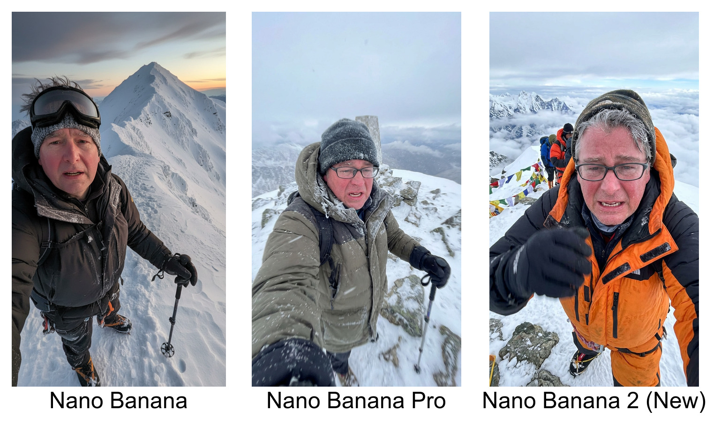

# Nano Banana Evaluation Results

## 1. The "Environmental Integration" Test

**The Task:** "Generate a close-up selfie of the man in this image on the summit of Mount Everest. He is wearing a heavy down suit, his oxygen mask is pulled down around his neck, and his beard is heavily frosted with ice. The lighting is a golden sunrise."

**The Goal:** This checks how well the model applies environmental effects (like frost and ice on facial hair) to a specific reference face without losing the subject's core identity.

---

## 2. The "Complex Background Depth" Test

**The Task:** "Generate a vertical selfie of the man in this image waiting in a line of climbers at the Hillary Step. He is clipped to a fixed rope, with steep rock, blue ice, and other climbers fading into the blowing snow in the background."

**The Goal:** This evaluates the model's spatial reasoning and depth of field, ensuring the reference subject stands out naturally against a highly cluttered, high-contrast, and chaotic background.

---

## 3. The "Material Interaction" Test

**The Task:** "Generate a selfie of the man in this image at Everest Base Camp. He is holding a steaming mug of tea, and the lenses of his glasses are slightly fogged up from the steam. Yellow tents are visible behind him."

**The Goal:** This tests the model's ability to render complex material physics—specifically, how condensation, transparency, and steam interact with the reference subject's existing eyewear.

---

## 4. The "Extreme Perspective" Test

**The Task:** "Generate an action selfie of the man in this image crossing a metal ladder over a deep crevasse. The camera angle is an extreme high-angle shot, looking down past his face towards his crampon-clad feet and the infinite blue ice below."

**The Goal:** This pushes the model's geometric understanding, testing if it can accurately map the reference face to a severe downward camera angle without stretching or distorting the features.

---

## 5. The "Low-Light Fidelity" Test

**The Task:** "Generate a gritty selfie of the man in this image hunched inside a dim yellow tent during a blizzard at the South Col. He is wearing a balaclava, with blowing snow visible through the partially open tent flap."

**The Goal:** This checks if the model can maintain facial recognition and high-fidelity skin textures in low-light, high-noise environments where shadows obscure part of the face.

---

## 6. The "Physiological Alteration" Test

**The Task:** "Generate a selfie of the man in this image sitting on a rock in the 'Death Zone' at 8,000 meters. Alter his face to look utterly exhausted: give him gaunt cheeks, cracked lips, and weary, bloodshot eyes, but keep him completely recognizable."

**The Goal:** This is a rigorous test of identity preservation. Can the model apply specific, targeted physiological wear-and-tear to the reference face without morphing him into a different person?

---

## 7. The "Extreme Lighting" Test

**The Task:** "Generate a wide-angle selfie of the man in this image on the summit. The sun is cresting the horizon directly behind his head, casting harsh, directional backlighting and a lens flare, with the curvature of the Earth visible in the distance."

**The Goal:** This evaluates the model's handling of extreme, directional light sources and severe shadows on the subject's face while maintaining photorealism and identity.

---

## 8. The "Dynamic Action Framing" Test

**The Task:** "Generate a dynamic selfie of the man in this image rappelling backwards down a vertical ice wall. The camera angle is looking slightly up at him as he leans back on the rope, with ice chips flying through the air."

**The Goal:** This tests the model's ability to position the reference face naturally within a high-tension, physically demanding pose, ensuring the neck and jawline map correctly to the torso.

---

## 9. The "Multi-Subject Context" Test

**The Task:** "Generate a selfie of the man in this image sitting at a Puja ceremony at Base Camp. He is surrounded by three Sherpas in traditional climbing gear, with a stone altar and thick juniper smoke blending into the scene."

**The Goal:** This checks if the model can seamlessly integrate the reference subject into a scene alongside newly generated human faces without stylistic clashing, bleeding features between faces, or making the reference look "pasted in."

---

## 10. The "Motion Blur & Artifacting" Test

**The Task:** "Generate a point-of-view selfie of the man in this image taking his final, grueling steps to the summit. The image should have a slight motion blur to simulate a shaking, freezing hand holding the camera."

**The Goal:** This evaluates whether the model can intentionally and realistically degrade the image quality (using motion blur) without the underlying facial structure collapsing into an unrecognizable smear.

---

